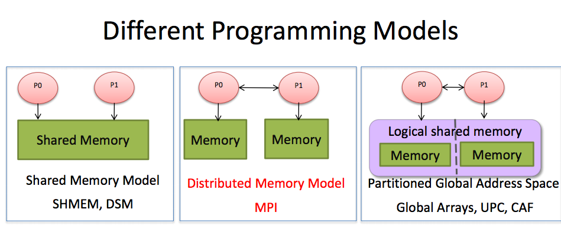
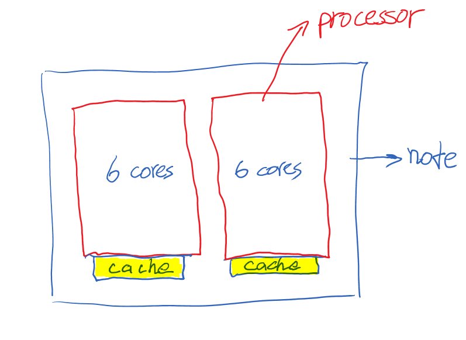

# MPI and OpenMP
2013 08 20


# Parallel Computing Tutorial

* * *

# HPC


I've tried different nodes&processes combination on Lightning and Lonester. To get access to Lonester,

```
ssh username@lonestar.tacc.utexas.edu
```


## MPI

### Message Passing Interface

#### Graph ( from TACC )



* each process has a different memory
* processes need to communicate with each other
* can also be used for shared memory(do what OpenMp do)

#### MPI Execution

* each process runs a copy of the executable:

**S**ingle **P**rogram, **M**ultiple **D**ata(SPMD) * Each process picks the portion of the work according to its rank * Each process works independent of the other processes, except when communicating

#### Code

###### initialize MPI


```
MPI::Init();
int myRank=MPI::COMM_WORLD.Get_rank();
int clusterSize=MPI::COMM_WORLD.Get_size();
```


###### communicating [Bcast](https://computing.llnl.gov/tutorials/mpi/images/MPI_Bcast.gif) [Gather](https://computing.llnl.gov/tutorials/mpi/images/MPI_Gather.gif) [Allreduce](https://computing.llnl.gov/tutorials/mpi/images/MPI_Allreduce.gif) [Scatter](https://computing.llnl.gov/tutorials/mpi/images/MPI_Scatter.gif)


```
MPI::COMM_WORLD.Bcast(&Alpha(0),numberMarkers,MPI_FLOAT,0)  MPI::COMM_WORLD.Gatherv(&a(0),iSize,MPI_FLOAT,&aFull(0),recvcount,dispel,MPI_FLOAT,0)
```


##### finalize


```
MPI::Finalize()
```


#### initial results and questions

###### superlinear

Each processor has its own cache

###### Why 10M obsevations and 500 markers linear scaling, but the 10M observations and 50k markers only get 1/4?

cache 

#### Compiling

* mpicxx for C++

Tutorial [Click Here](https://computing.llnl.gov/tutorials/mpi/)

TACC [Click Here](http://www.tacc.utexas.edu/c/document_library/get_file?uuid=0987c33e-f95f-4565-9f08-656d398f1173&groupId=13601)

## OpenMP

#### tutorial

Get from tutorial material in TACC. [Click Here](http://www.tacc.utexas.edu/user-services/training/course-materials)

#### Eigen with OpenMP

## Difference between MPI and OpenMP

**OpenMP** Only runs efficiently in the shared-memory multiprocessor and mostly used for loop parallelization.

**MPI** Doesn't require shared memory architecture and can run on both shared memory and distributed memory architecture.

[More](http://wiki.utep.edu/display/CPSQualifyingExam/Question+5+-+Difference+between+MPI+and+Open+MP)

## Mixing MPI and OpenMP

[Click Here](http://www.slac.stanford.edu/comp/unix/farm/mpi_and_openmp.html)

## other course materials

[Click here](http://www.tacc.utexas.edu/user-services/training/course-materials)

## Reminder

1. On lonestar, tasks are same as MPI processes.


* * *


